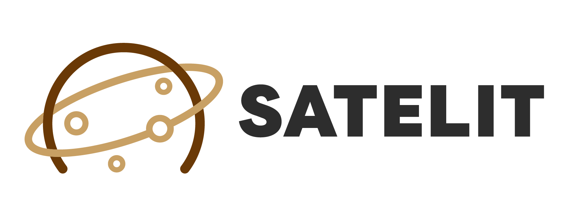

# satelit: Control Plane And Framework for Internal Cloud

satelit is a control plane for [lovi-cloud](https://github.com/lovi-cloud) AND Framework of internal cloud.

The name "satelit" is derived from a Bosnian word that means "Satellite".

## Features

- Control Plane for [lovi-cloud](https://github.com/lovi-cloud)
- Framework for Internal Cloud

## Getting Started

### As Internal Cloud

Please see [INSTALL_cloud.md](https://github.com/lovi-cloud/docs/INSTALL_cloud.md).

### As Framework

Please see [framework.md](https://github.com/lovi-cloud/docs/framework.md).